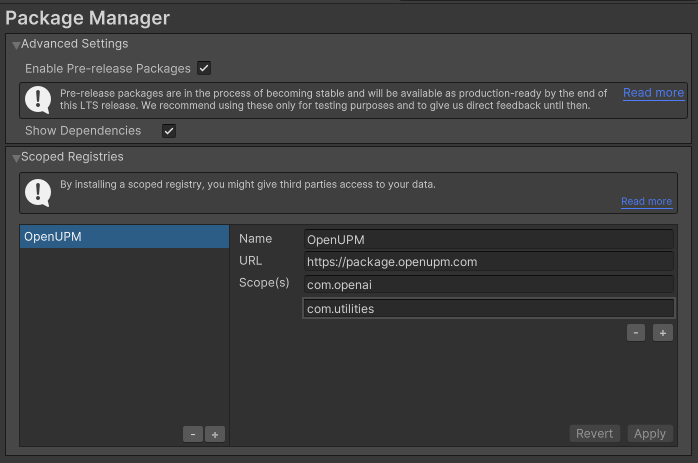
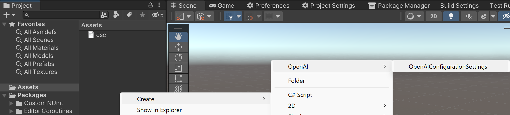

# OpenAI

[](https://discord.gg/xQgMW9ufN4) [](https://openupm.com/packages/com.openai.unity/) [](https://openupm.com/packages/com.openai.unity/)

Based on [OpenAI-DotNet](https://github.com/RageAgainstThePixel/OpenAI-DotNet)

A [OpenAI](https://openai.com/) package for the [Unity](https://unity.com/) Game Engine to use chat-gpt, GPT-4, GPT-3.5-Turbo and Dall-E though their RESTful API (currently in beta).  Independently developed, this is not an official library and I am not affiliated with OpenAI.  An OpenAI API account is required.

***All copyrights, trademarks, logos, and assets are the property of their respective owners.***

> This repository is available to transfer to the OpenAI organization if they so choose to accept it.

## Installing

Requires Unity 2021.3 LTS or higher.

The recommended installation method is though the unity package manager and [OpenUPM](https://openupm.com/packages/com.openai.unity).

### Via Unity Package Manager and OpenUPM

- Open your Unity project settings
- Add the OpenUPM package registry:
  - Name: `OpenUPM`
  - URL: `https://package.openupm.com`
  - Scope(s):
    - `com.openai`
    - `com.utilities`



- Open the Unity Package Manager window
- Change the Registry from Unity to `My Registries`
- Add the `OpenAI` package

### Via Unity Package Manager and Git url

- Open your Unity Package Manager
- Add package from git url: `https://github.com/RageAgainstThePixel/com.openai.unity.git#upm`
  > Note: this repo has dependencies on other repositories! You are responsible for adding these on your own.
  - [com.utilities.async](https://github.com/RageAgainstThePixel/com.utilities.async)
  - [com.utilities.extensions](https://github.com/RageAgainstThePixel/com.utilities.extensions)
  - [com.utilities.rest](https://github.com/RageAgainstThePixel/com.utilities.rest)
  - [com.utilities.audio](https://github.com/RageAgainstThePixel/com.utilities.audio)
  - [com.utilities.encoder.wav](https://github.com/RageAgainstThePixel/com.utilities.encoder.wav)

---

## Documentation

### Table of Contents

- [Authentication](#authentication)
- [Azure OpenAI](#azure-openai)
  - [Azure Active Directory Authentication](#azure-active-directory-authentication)
- [OpenAI API Proxy](#openai-api-proxy)
- [Models](#models)
  - [List Models](#list-models)
  - [Retrieve Models](#retrieve-model)
  - [Delete Fine Tuned Model](#delete-fine-tuned-model)
- [Completions](#completions)
  - [Streaming](#completion-streaming)
- [Chat](#chat)
  - [Chat Completions](#chat-completions)
  - [Streaming](#chat-streaming)
  - [Tools](#chat-tools) :new:
  - [Vision](#chat-vision) :new:
- [Edits](#edits)
  - [Create Edit](#create-edit)
- [Embeddings](#embeddings)
  - [Create Embedding](#create-embeddings)
- [Audio](#audio)
  - [Create Speech](#create-speech)
  - [Create Transcription](#create-transcription)
  - [Create Translation](#create-translation)
- [Images](#images)
  - [Create Image](#create-image)
  - [Edit Image](#edit-image)
  - [Create Image Variation](#create-image-variation)
- [Files](#files)
  - [List Files](#list-files)
  - [Upload File](#upload-file)
  - [Delete File](#delete-file)
  - [Retrieve File Info](#retrieve-file-info)
  - [Download File Content](#download-file-content)
- [Fine Tuning](#fine-tuning)
  - [Create Fine Tune Job](#create-fine-tune-job)
  - [List Fine Tune Jobs](#list-fine-tune-jobs)
  - [Retrieve Fine Tune Job Info](#retrieve-fine-tune-job-info)
  - [Cancel Fine Tune Job](#cancel-fine-tune-job)
  - [List Fine Tune Job Events](#list-fine-tune-job-events)
- [Moderations](#moderations)
  - [Create Moderation](#create-moderation)

### Authentication

There are 4 ways to provide your API keys, in order of precedence:

1. [Pass keys directly with constructor](#pass-keys-directly-with-constructor)
2. [Unity Scriptable Object](#unity-scriptable-object)
3. [Load key from configuration file](#load-key-from-configuration-file)
4. [Use System Environment Variables](#use-system-environment-variables)

You use the `OpenAIAuthentication` when you initialize the API as shown:

#### Pass keys directly with constructor

:warning: We recommended using the environment variables to load the API key instead of having it hard coded in your source. It is not recommended use this method in production, but only for accepting user credentials, local testing and quick start scenarios.

```csharp
var api = new OpenAIClient("sk-apiKey");
```

Or create a `OpenAIAuthentication` object manually

```csharp
var api = new OpenAIClient(new OpenAIAuthentication("sk-apiKey", "org-yourOrganizationId"));
```

#### Unity Scriptable Object

You can save the key directly into a scriptable object that is located in the `Assets/Resources` folder.

You can create a new one by using the context menu of the project pane and creating a new `OpenAIConfiguration` scriptable object.

:warning: Beware checking this file into source control, as other people will be able to see your API key. It is recommended to use the [OpenAI-DotNet-Proxy](#openai-api-proxy) and authenticate users with your preferred OAuth provider.



#### Load key from configuration file

Attempts to load api keys from a configuration file, by default `.openai` in the current directory, optionally traversing up the directory tree or in the user's home directory.

To create a configuration file, create a new text file named `.openai` and containing the line:

> Organization entry is optional.

##### Json format

```json
{
  "apiKey": "sk-aaaabbbbbccccddddd",
  "organization": "org-yourOrganizationId"
}
```

##### Deprecated format

```shell
OPENAI_KEY=sk-aaaabbbbbccccddddd
ORGANIZATION=org-yourOrganizationId
```

You can also load the configuration file directly with known path by calling static methods in `OpenAIAuthentication`:

- Loads the default `.openai` config in the specified directory:

```csharp
var api = new OpenAIClient(OpenAIAuthentication.Default.LoadFromDirectory("path/to/your/directory"));
```

- Loads the configuration file from a specific path. File does not need to be named `.openai` as long as it conforms to the json format:

```csharp
var api = new OpenAIClient(OpenAIAuthentication.Default.LoadFromPath("path/to/your/file.json"));
```

#### Use System Environment Variables

Use your system's environment variables specify an api key and organization to use.

- Use `OPENAI_API_KEY` for your api key.
- Use `OPENAI_ORGANIZATION_ID` to specify an organization.

```csharp
var api = new OpenAIClient(OpenAIAuthentication.Default.LoadFromEnvironment());
```

### [Azure OpenAI](https://learn.microsoft.com/en-us/azure/cognitive-services/openai/)

You can also choose to use Microsoft's Azure OpenAI deployments as well.

You can find the required information in the Azure Playground by clicking the `View Code` button and view a URL like this:

```markdown
https://{your-resource-name}.openai.azure.com/openai/deployments/{deployment-id}/chat/completions?api-version={api-version}
```

- `your-resource-name` The name of your Azure OpenAI Resource.
- `deployment-id` The deployment name you chose when you deployed the model.
- `api-version` The API version to use for this operation. This follows the YYYY-MM-DD format.

To setup the client to use your deployment, you'll need to pass in `OpenAISettings` into the client constructor.

```csharp
var auth = new OpenAIAuthentication("sk-apiKey");
var settings = new OpenAISettings(resourceName: "your-resource-name", deploymentId: "deployment-id", apiVersion: "api-version");
var api = new OpenAIClient(auth, settings);
```

#### [Azure Active Directory Authentication](https://learn.microsoft.com/en-us/azure/cognitive-services/openai/reference#authentication)

[Authenticate with MSAL](https://github.com/AzureAD/microsoft-authentication-library-for-dotnet) as usual and get access token, then use the access token when creating your `OpenAIAuthentication`. Then be sure to set useAzureActiveDirectory to true when creating your `OpenAISettings`.

[Tutorial: Desktop app that calls web APIs: Acquire a token](https://learn.microsoft.com/en-us/azure/active-directory/develop/scenario-desktop-acquire-token?tabs=dotnet)

```csharp
// get your access token using any of the MSAL methods
var accessToken = result.AccessToken;
var auth = new OpenAIAuthentication(accessToken);
var settings = new OpenAISettings(resourceName: "your-resource", deploymentId: "deployment-id", apiVersion: "api-version", useActiveDirectoryAuthentication: true);
var api = new OpenAIClient(auth, settings);
```

### [OpenAI API Proxy](https://github.com/RageAgainstThePixel/OpenAI-DotNet/blob/main/OpenAI-DotNet-Proxy/Readme.md)

[](https://www.nuget.org/packages/OpenAI-DotNet-Proxy/)

Using either the [OpenAI-DotNet](https://github.com/RageAgainstThePixel/OpenAI-DotNet) or [com.openai.unity](https://github.com/RageAgainstThePixel/com.openai.unity) packages directly in your front-end app may expose your API keys and other sensitive information. To mitigate this risk, it is recommended to set up an intermediate API that makes requests to OpenAI on behalf of your front-end app. This library can be utilized for both front-end and intermediary host configurations, ensuring secure communication with the OpenAI API.

#### Front End Example

In the front end example, you will need to securely authenticate your users using your preferred OAuth provider. Once the user is authenticated, exchange your custom auth token with your API key on the backend.

Follow these steps:

1. Setup a new project using either the [OpenAI-DotNet](https://github.com/RageAgainstThePixel/OpenAI-DotNet) or [com.openai.unity](https://github.com/RageAgainstThePixel/com.openai.unity) packages.
2. Authenticate users with your OAuth provider.
3. After successful authentication, create a new `OpenAIAuthentication` object and pass in the custom token with the prefix `sess-`.
4. Create a new `OpenAISettings` object and specify the domain where your intermediate API is located.
5. Pass your new `auth` and `settings` objects to the `OpenAIClient` constructor when you create the client instance.

Here's an example of how to set up the front end:

```csharp
var authToken = await LoginAsync();
var auth = new OpenAIAuthentication($"sess-{authToken}");
var settings = new OpenAISettings(domain: "api.your-custom-domain.com");
var api = new OpenAIClient(auth, settings);
```

This setup allows your front end application to securely communicate with your backend that will be using the OpenAI-DotNet-Proxy, which then forwards requests to the OpenAI API. This ensures that your OpenAI API keys and other sensitive information remain secure throughout the process.

#### Back End Example

In this example, we demonstrate how to set up and use `OpenAIProxyStartup` in a new ASP.NET Core web app. The proxy server will handle authentication and forward requests to the OpenAI API, ensuring that your API keys and other sensitive information remain secure.

1. Create a new [ASP.NET Core minimal web API](https://learn.microsoft.com/en-us/aspnet/core/tutorials/min-web-api?view=aspnetcore-6.0) project.
2. Add the OpenAI-DotNet nuget package to your project.
    - Powershell install: `Install-Package OpenAI-DotNet-Proxy`
    - Manually editing .csproj: `<PackageReference Include="OpenAI-DotNet-Proxy" />`
3. Create a new class that inherits from `AbstractAuthenticationFilter` and override the `ValidateAuthentication` method. This will implement the `IAuthenticationFilter` that you will use to check user session token against your internal server.
4. In `Program.cs`, create a new proxy web application by calling `OpenAIProxyStartup.CreateDefaultHost` method, passing your custom `AuthenticationFilter` as a type argument.
5. Create `OpenAIAuthentication` and `OpenAIClientSettings` as you would normally with your API keys, org id, or Azure settings.

```csharp
public partial class Program
{
    private class AuthenticationFilter : AbstractAuthenticationFilter
    {
        public override void ValidateAuthentication(IHeaderDictionary request)
        {
            // You will need to implement your own class to properly test
            // custom issued tokens you've setup for your end users.
            if (!request.Authorization.ToString().Contains(userToken))
            {
                throw new AuthenticationException("User is not authorized");
            }
        }
    }

    public static void Main(string[] args)
    {
        var auth = OpenAIAuthentication.LoadFromEnv();
        var settings = new OpenAIClientSettings(/* your custom settings if using Azure OpenAI */);
        var openAIClient = new OpenAIClient(auth, settings);
        var proxy = OpenAIProxyStartup.CreateDefaultHost<AuthenticationFilter>(args, openAIClient);
        proxy.Run();
    }
}
```

Once you have set up your proxy server, your end users can now make authenticated requests to your proxy api instead of directly to the OpenAI API. The proxy server will handle authentication and forward requests to the OpenAI API, ensuring that your API keys and other sensitive information remain secure.

### [Models](https://platform.openai.com/docs/api-reference/models)

List and describe the various models available in the API. You can refer to the [Models documentation](https://platform.openai.com/docs/models) to understand what models are available and the differences between them.

Also checkout [model endpoint compatibility](https://platform.openai.com/docs/models/model-endpoint-compatibility) to understand which models work with which endpoints.

To specify a custom model not pre-defined in this library:

```csharp
var model = new Model("model-id");
```

The Models API is accessed via `OpenAIClient.ModelsEndpoint`

#### [List models](https://platform.openai.com/docs/api-reference/models/list)

Lists the currently available models, and provides basic information about each one such as the owner and availability.

```csharp
var api = new OpenAIClient();
var models = await api.ModelsEndpoint.GetModelsAsync();

foreach (var model in models)
{
    Debug.Log(model.ToString());
}
```

#### [Retrieve model](https://platform.openai.com/docs/api-reference/models/retrieve)

Retrieves a model instance, providing basic information about the model such as the owner and permissions.

```csharp
var api = new OpenAIClient();
var model = await api.ModelsEndpoint.GetModelDetailsAsync("text-davinci-003");
Debug.Log(model.ToString());
```

#### [Delete Fine Tuned Model](https://platform.openai.com/docs/api-reference/fine-tunes/delete-model)

Delete a fine-tuned model. You must have the Owner role in your organization.

```csharp
var api = new OpenAIClient();
var result = await api.ModelsEndpoint.DeleteFineTuneModelAsync("your-fine-tuned-model");
Assert.IsTrue(result);
```

### [Completions](https://platform.openai.com/docs/api-reference/completions)

Given a prompt, the model will return one or more predicted completions, and can also return the probabilities of alternative tokens at each position.

The Completions API is accessed via `OpenAIClient.CompletionsEndpoint`

```csharp
var api = new OpenAIClient();
var result = await api.CompletionsEndpoint.CreateCompletionAsync("One Two Three One Two", temperature: 0.1, model: Model.Davinci);
Debug.Log(result);
```

> To get the `CompletionResult` (which is mostly metadata), use its implicit string operator to get the text if all you want is the completion choice.

#### Completion Streaming

Streaming allows you to get results are they are generated, which can help your application feel more responsive, especially on slow models like Davinci.

```csharp
var api = new OpenAIClient();

await api.CompletionsEndpoint.StreamCompletionAsync(result =>
{
    foreach (var choice in result.Completions)
    {
        Debug.Log(choice);
    }
}, "My name is Roger and I am a principal software engineer at Salesforce.  This is my resume:", maxTokens: 200, temperature: 0.5, presencePenalty: 0.1, frequencyPenalty: 0.1, model: Model.Davinci);
```

### [Chat](https://platform.openai.com/docs/api-reference/chat)

Given a chat conversation, the model will return a chat completion response.

The Chat API is accessed via `OpenAIClient.ChatEndpoint`

#### [Chat Completions](https://platform.openai.com/docs/api-reference/chat/create)

Creates a completion for the chat message

```csharp
var api = new OpenAIClient();
var messages = new List<Message>
{
    new Message(Role.System, "You are a helpful assistant."),
    new Message(Role.User, "Who won the world series in 2020?"),
    new Message(Role.Assistant, "The Los Angeles Dodgers won the World Series in 2020."),
    new Message(Role.User, "Where was it played?"),
};
var chatRequest = new ChatRequest(messages, Model.GPT3_5_Turbo);
var result = await api.ChatEndpoint.GetCompletionAsync(chatRequest);
Debug.Log($"{result.FirstChoice.Message.Role}: {result.FirstChoice.Message.Content}");
```

##### [Chat Streaming](https://platform.openai.com/docs/api-reference/chat/create#chat/create-stream)

```csharp
var api = new OpenAIClient();
var messages = new List<Message>
{
    new Message(Role.System, "You are a helpful assistant."),
    new Message(Role.User, "Who won the world series in 2020?"),
    new Message(Role.Assistant, "The Los Angeles Dodgers won the World Series in 2020."),
    new Message(Role.User, "Where was it played?"),
};
var chatRequest = new ChatRequest(messages, Model.GPT3_5_Turbo, number: 2);
await api.ChatEndpoint.StreamCompletionAsync(chatRequest, result =>
{
    foreach (var choice in result.Choices.Where(choice => !string.IsNullOrEmpty(choice.Delta?.Content)))
    {
        // Partial response content
        Debug.Log(choice.Delta.Content);
    }

    foreach (var choice in result.Choices.Where(choice => !string.IsNullOrEmpty(choice.Message?.Content)))
    {
        // Completed response content
        Debug.Log($"{choice.Message.Role}: {choice.Message.Content}");
    }
});
```

##### [Chat Tools](https://platform.openai.com/docs/guides/function-calling)

> Only available with the latest 0613 model series!

```csharp
var api = new OpenAIClient();
var messages = new List<Message>
{
    new Message(Role.System, "You are a helpful weather assistant."),
    new Message(Role.User, "What's the weather like today?"),
};

foreach (var message in messages)
{
    Debug.Log($"{message.Role}: {message.Content}");
}

// Define the tools that the assistant is able to use:
var tools = new List<Tool>
{
    new Function(
        nameof(WeatherService.GetCurrentWeather),
        "Get the current weather in a given location",
            new JObject
            {
                ["type"] = "object",
                ["properties"] = new JObject
                {
                    ["location"] = new JObject
                    {
                        ["type"] = "string",
                        ["description"] = "The city and state, e.g. San Francisco, CA"
                    },
                    ["unit"] = new JObject
                    {
                        ["type"] = "string",
                        ["enum"] = new JArray {"celsius", "fahrenheit"}
                    }
                },
                ["required"] = new JArray { "location", "unit" }
            })
};

var chatRequest = new ChatRequest(messages, tools: tools, toolChoice: "auto");
var result = await api.ChatEndpoint.GetCompletionAsync(chatRequest);
messages.Add(result.FirstChoice.Message);

Debug.Log($"{result.FirstChoice.Message.Role}: {result.FirstChoice.Message.Content} | Finish Reason: {result.FirstChoice.FinishReason}");

var locationMessage = new Message(Role.User, "I'm in Glasgow, Scotland");
messages.Add(locationMessage);
Debug.Log($"{locationMessage.Role}: {locationMessage.Content}");
chatRequest = new ChatRequest(messages, tools: tools, toolChoice: "auto");
result = await api.ChatEndpoint.GetCompletionAsync(chatRequest);

messages.Add(result.FirstChoice.Message);

if (!string.IsNullOrEmpty(result.FirstChoice.Message.Content))
{
    Debug.Log($"{result.FirstChoice.Message.Role}: {result.FirstChoice.Message.Content} | Finish Reason: {result.FirstChoice.FinishReason}");

    var unitMessage = new Message(Role.User, "celsius");
    messages.Add(unitMessage);
    Debug.Log($"{unitMessage.Role}: {unitMessage.Content}");
    chatRequest = new ChatRequest(messages, tools: tools, toolChoice: "auto");
    result = await api.ChatEndpoint.GetCompletionAsync(chatRequest);
}

var usedTool = result.FirstChoice.Message.ToolCalls[0];
Debug.Log($"{result.FirstChoice.Message.Role}: {usedTool.Function.Name} | Finish Reason: {result.FirstChoice.FinishReason}");
Debug.Log($"{usedTool.Function.Arguments}");
var functionArgs = JsonSerializer.Deserialize<WeatherArgs>(usedTool.Function.Arguments.ToString());
var functionResult = WeatherService.GetCurrentWeather(functionArgs);
messages.Add(new Message(usedTool, functionResult));
Debug.Log($"{Role.Tool}: {functionResult}");
// System: You are a helpful weather assistant.
// User: What's the weather like today?
// Assistant: Sure, may I know your current location? | Finish Reason: stop
// User: I'm in Glasgow, Scotland
// Assistant: GetCurrentWeather | Finish Reason: tool_calls
// {
//   "location": "Glasgow, Scotland",
//   "unit": "celsius"
// }
// Tool: The current weather in Glasgow, Scotland is 20 celsius
```

##### [Chat Vision](https://platform.openai.com/docs/guides/vision)

:construction: This feature is in beta!

> Currently, GPT-4 with vision does not support the message.name parameter, functions/tools, nor the response_format parameter.

```csharp
var api = new OpenAIClient();
var messages = new List<Message>
{
    new Message(Role.System, "You are a helpful assistant."),
    new Message(Role.User, new List<Content>
    {
        new Content(ContentType.Text, "What's in this image?"),
        new Content(ContentType.ImageUrl, "https://upload.wikimedia.org/wikipedia/commons/thumb/d/dd/Gfp-wisconsin-madison-the-nature-boardwalk.jpg/2560px-Gfp-wisconsin-madison-the-nature-boardwalk.jpg")
    })
};
var chatRequest = new ChatRequest(messages, model: "gpt-4-vision-preview");
var result = await apiChatEndpoint.GetCompletionAsync(chatRequest);
Debug.Log($"{result.FirstChoice.Message.Role}: {result.FirstChoice.Message.Content} | Finish Reason: {result.FirstChoice.FinishDetails}");
```

You can even pass in a `Texture2D`!

```csharp
var api = new OpenAIClient();
var messages = new List<Message>
{
    new Message(Role.System, "You are a helpful assistant."),
    new Message(Role.User, new List<Content>
    {
        new Content(ContentType.Text, "What's in this image?"),
        new Content(texture)
    })
};
var chatRequest = new ChatRequest(messages, model: "gpt-4-vision-preview");
var result = await apiChatEndpoint.GetCompletionAsync(chatRequest);
Debug.Log($"{result.FirstChoice.Message.Role}: {result.FirstChoice.Message.Content} | Finish Reason: {result.FirstChoice.FinishDetails}");
```

### [Edits](https://platform.openai.com/docs/api-reference/edits)

> Deprecated, and soon to be removed.

Given a prompt and an instruction, the model will return an edited version of the prompt.

The Edits API is accessed via `OpenAIClient.EditsEndpoint`

#### [Create Edit](https://platform.openai.com/docs/api-reference/edits/create)

Creates a new edit for the provided input, instruction, and parameters using the provided input and instruction.

```csharp
var api = new OpenAIClient();
var request = new EditRequest("What day of the wek is it?", "Fix the spelling mistakes");
var result = await api.EditsEndpoint.CreateEditAsync(request);
Debug.Log(result);
```

### [Embeddings](https://platform.openai.com/docs/api-reference/embeddings)

Get a vector representation of a given input that can be easily consumed by machine learning models and algorithms.

Related guide: [Embeddings](https://platform.openai.com/docs/guides/embeddings)

The Edits API is accessed via `OpenAIClient.EmbeddingsEndpoint`

#### [Create Embeddings](https://platform.openai.com/docs/api-reference/embeddings/create)

Creates an embedding vector representing the input text.

```csharp
var api = new OpenAIClient();
var result = await api.EmbeddingsEndpoint.CreateEmbeddingAsync("The food was delicious and the waiter...", Models.Embedding_Ada_002);
Debug.Log(result);
```

### [Audio](https://platform.openai.com/docs/api-reference/audio)

Converts audio into text.

The Audio API is accessed via `OpenAIClient.AudioEndpoint`

#### [Create Speech](https://platform.openai.com/docs/api-reference/audio/createSpeech)

Generates audio from the input text.

```csharp
var api = new OpenAIClient();
var request = new SpeechRequest("Hello world!");
var (path, clip) = await api.AudioEndpoint.CreateSpeechAsync(request);
audioSource.PlayOneShot(clip);
```

#### [Create Transcription](https://platform.openai.com/docs/api-reference/audio/createTranscription)

Transcribes audio into the input language.

```csharp
var api = new OpenAIClient();
var request = new AudioTranscriptionRequest(audioClip, language: "en");
var result = await api.AudioEndpoint.CreateTranscriptionAsync(request);
Debug.Log(result);
```

#### [Create Translation](https://platform.openai.com/docs/api-reference/audio/createTranslation)

Translates audio into into English.

```csharp
var api = new OpenAIClient();
var request = new AudioTranslationRequest(audioClip);
var result = await api.AudioEndpoint.CreateTranslationAsync(request);
Debug.Log(result);
```

### [Images](https://platform.openai.com/docs/api-reference/images)

Given a prompt and/or an input image, the model will generate a new image.

The Images API is accessed via `OpenAIClient.ImagesEndpoint`

#### [Create Image](https://platform.openai.com/docs/api-reference/images/create)

Creates an image given a prompt.

```csharp
var api = new OpenAIClient();
var request = new ImageGenerationRequest("A house riding a velociraptor", Model.DallE_3);
var results = await api.ImagesEndPoint.GenerateImageAsync(request);

foreach (var (path, texture) in results)
{
    Debug.Log(path);
    // path == file://path/to/image.png
    Assert.IsNotNull(texture);
    // texture == The preloaded Texture2D
}
```

#### [Edit Image](https://platform.openai.com/docs/api-reference/images/create-edit)

Creates an edited or extended image given an original image and a prompt.

```csharp
var api = new OpenAIClient();
var request = new ImageEditRequest(Path.GetFullPath(imageAssetPath), Path.GetFullPath(maskAssetPath), "A sunlit indoor lounge area with a pool containing a flamingo", size: ImageSize.Small);
var results = await api.ImagesEndPoint.CreateImageEditAsync(request);

foreach (var (path, texture) in results)
{
    Debug.Log(path);
    // path == file://path/to/image.png
    Assert.IsNotNull(texture);
    // texture == The preloaded Texture2D
}
```

#### [Create Image Variation](https://platform.openai.com/docs/api-reference/images/create-variation)

Creates a variation of a given image.

```csharp
var api = new OpenAIClient();
var request = new ImageVariationRequest(imageTexture, size: ImageSize.Small);
var results = await api.ImagesEndPoint.CreateImageVariationAsync(request);

foreach (var (path, texture) in results)
{
    Debug.Log(path);
    // path == file://path/to/image.png
    Assert.IsNotNull(texture);
    // texture == The preloaded Texture2D
}
```

Alternatively, the endpoint can directly take a Texture2D with Read/Write enabled and Compression set to None.

```csharp
var api = new OpenAIClient();
var request = new ImageVariationRequest(imageTexture, size: ImageSize.Small);
var results = await api.ImagesEndPoint.CreateImageVariationAsync(request);
// imageTexture is of type Texture2D
foreach (var (path, texture) in results)
{
    Debug.Log(path);
    // path == file://path/to/image.png
    Assert.IsNotNull(texture);
    // texture == The preloaded Texture2D
}
```

### [Files](https://platform.openai.com/docs/api-reference/files)

Files are used to upload documents that can be used with features like [Fine-tuning](#fine-tuning).

The Files API is accessed via `OpenAIClient.FilesEndpoint`

#### [List Files](https://platform.openai.com/docs/api-reference/files/list)

Returns a list of files that belong to the user's organization.

```csharp
var api = new OpenAIClient();
var files = await api.FilesEndpoint.ListFilesAsync();

foreach (var file in files)
{
    Debug.Log($"{file.Id} -> {file.Object}: {file.FileName} | {file.Size} bytes");
}
```

#### [Upload File](https://platform.openai.com/docs/api-reference/files/upload)

Upload a file that contains document(s) to be used across various endpoints/features. Currently, the size of all the files uploaded by one organization can be up to 1 GB. Please contact us if you need to increase the storage limit.

```csharp
var api = new OpenAIClient();
var fileData = await api.FilesEndpoint.UploadFileAsync("path/to/your/file.jsonl", "fine-tune");
Debug.Log(fileData.Id);
```

#### [Delete File](https://platform.openai.com/docs/api-reference/files/delete)

Delete a file.

```csharp
var api = new OpenAIClient();
var result = await api.FilesEndpoint.DeleteFileAsync(fileData);
Assert.IsTrue(result);
```

#### [Retrieve File Info](https://platform.openai.com/docs/api-reference/files/retrieve)

Returns information about a specific file.

```csharp
var api = new OpenAIClient();
var fileData = await GetFileInfoAsync(fileId);
Debug.Log($"{fileData.Id} -> {fileData.Object}: {fileData.FileName} | {fileData.Size} bytes");
```

#### [Download File Content](https://platform.openai.com/docs/api-reference/files/retrieve-content)

Downloads the specified file.

```csharp
var api = new OpenAIClient();
var downloadedFilePath = await api.FilesEndpoint.DownloadFileAsync(fileId);
Debug.Log(downloadedFilePath);
Assert.IsTrue(File.Exists(downloadedFilePath));
```

### [Fine Tuning](https://platform.openai.com/docs/api-reference/fine-tuning)

Manage fine-tuning jobs to tailor a model to your specific training data.

Related guide: [Fine-tune models](https://platform.openai.com/docs/guides/fine-tuning)

The Files API is accessed via `OpenAIClient.FineTuningEndpoint`

#### [Create Fine Tune Job](https://platform.openai.com/docs/api-reference/fine-tuning/create)

Creates a job that fine-tunes a specified model from a given dataset.

Response includes details of the enqueued job including job status and the name of the fine-tuned models once complete.

```csharp
var api = new OpenAIClient();
var fileId = "file-abc123";
var request = new CreateFineTuneRequest(fileId);
var job = await api.FineTuningEndpoint.CreateJobAsync(Model.GPT3_5_Turbo, request);
Debug.Log($"Started {job.Id} | Status: {job.Status}");
```

#### [List Fine Tune Jobs](https://platform.openai.com/docs/api-reference/fine-tuning/list)

List your organization's fine-tuning jobs.

```csharp
var api = new OpenAIClient();
var list = await api.FineTuningEndpoint.ListJobsAsync();

foreach (var job in list.Jobs)
{
    Debug.Log($"{job.Id} -> {job.Status}");
}
```

#### [Retrieve Fine Tune Job Info](https://platform.openai.com/docs/api-reference/fine-tuning/retrieve)

Gets info about the fine-tune job.

```csharp
var api = new OpenAIClient();
var job = await api.FineTuningEndpoint.GetJobInfoAsync(fineTuneJob);
Debug.Log($"{job.Id} -> {job.Status}");
```

#### [Cancel Fine Tune Job](https://platform.openai.com/docs/api-reference/fine-tuning/cancel)

Immediately cancel a fine-tune job.

```csharp
var api = new OpenAIClient();
var result = await api.FineTuningEndpoint.CancelFineTuneJobAsync(fineTuneJob);
Assert.IsTrue(result);
```

#### [List Fine Tune Job Events](https://platform.openai.com/docs/api-reference/fine-tuning/list-events)

Get status updates for a fine-tuning job.

```csharp
var api = new OpenAIClient();
var eventList = await api.FineTuningEndpoint.ListJobEventsAsync(fineTuneJob);
Debug.Log($"{fineTuneJob.Id} -> status: {fineTuneJob.Status} | event count: {eventList.Events.Count}");

foreach (var @event in eventList.Events.OrderByDescending(@event => @event.CreatedAt))
{
    Debug.Log($"  {@event.CreatedAt} [{@event.Level}] {@event.Message.Replace("\n", " ")}");
}
```

### [Moderations](https://platform.openai.com/docs/api-reference/moderations)

Given a input text, outputs if the model classifies it as violating OpenAI's content policy.

Related guide: [Moderations](https://platform.openai.com/docs/guides/moderation)

The Moderations API can be accessed via `OpenAIClient.ModerationsEndpoint`

#### [Create Moderation](https://platform.openai.com/docs/api-reference/moderations/create)

Classifies if text violates OpenAI's Content Policy.

```csharp
var api = new OpenAIClient();
var response = await api.ModerationsEndpoint.GetModerationAsync("I want to kill them.");
Assert.IsTrue(response);
```
